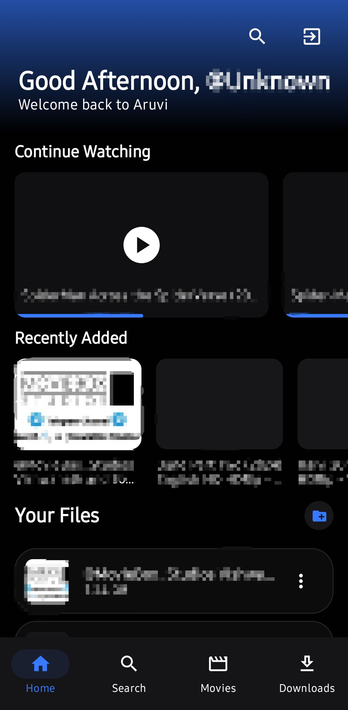
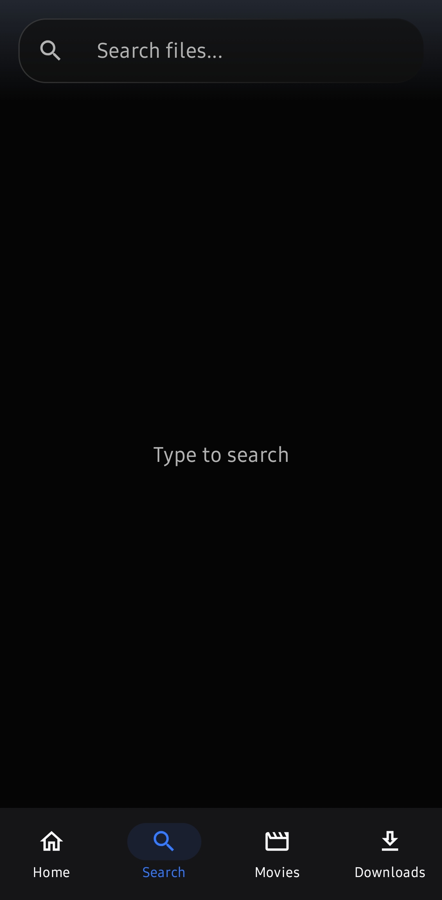
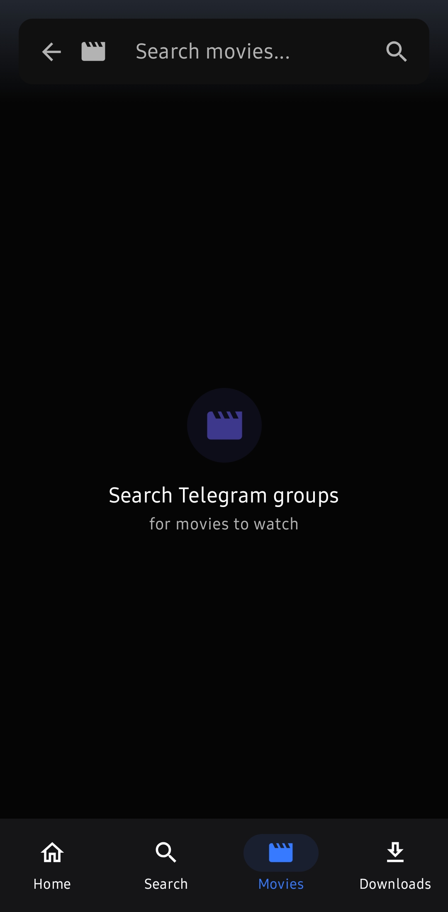
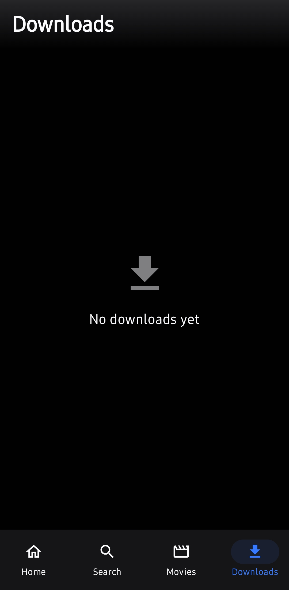

# Aruvi

[](LICENSE)
[](https://github.com/tirforge/Aruvi/releases)
[](https://github.com/tirforge/Aruvi/stargazers)


Self-hosted media platform that streams your own files from a private Telegram channel
to the browser, Android phone, Android TV, and desktop — powered by multi-bot parallel
streaming with a two-tier (RAM + disk) cache.

<table>
  <tr>
    <td></td>
    <td></td>
  </tr>
  <tr>
    <td></td>
    <td></td>
  </tr>
</table>

```
aruvi/
├── backend/      # FastAPI backend (streaming engine, Telegram bot, API, subtitles)
├── frontend/     # React SPA (web player + file manager)
├── android/      # Native Android / Android-TV app (Kotlin + Jetpack Compose)
└── docs/         # Architecture, streaming, auth, data model, deployment guides
```

## Features

- Stream large media directly from your private Telegram channel to any device
- Multi-bot parallel chunk fetching with a **RAM hot cache + disk cache** (survives restarts)
- Internet subtitle search + download (OpenSubtitles.com + keyless providers)
- Native clients: Android app (phone + TV) and Windows/Linux desktop apps
- Google Drive integration, thumbnails, continue-watching, folder management

## How It Works — You Bring Your Own Storage

Aruvi ships **no content**. Each deployment is fully self-hosted against *your own*
private Telegram channel:

1. **Create your storage** — make a private Telegram channel, set its ID in `.env`
2. **Add your files** — upload directly in Telegram or via the bot
3. **Stream anywhere** — web player, Android phone/tablet, Android TV, or the
   Windows/Linux desktop apps

Your server never talks to anyone else's instance — files live only in channels
you control.

## Quick Start

### 0. Docker (all-in-one, recommended)

```bash
cp .env.example .env          # fill in your Telegram credentials first
docker compose up -d --build
```
- Backend on `:7680` (override via `SERVER_PORT`)
- `./data` and `./session` bind-mounted for persistence

### 1. Backend (manual)

```bash
cd backend
python -m venv venv && source venv/bin/activate
pip install -r requirements.txt
cp ../.env.example .env        # .env lives in backend/ for manual; repo root for Docker (both work via load_dotenv)
# fill in: TELEGRAM_API_ID/HASH, TELEGRAM_BOT_TOKEN, TELEGRAM_STORAGE_CHANNEL_ID, AUTH_USERS
mkdir -p data session           # persisted: data/teleplay.db + data/.jwt_secret + session/*.session
python run.py
```
Web UI served from `backend/app/static` (prebuilt SPA bundle included).

> Windows / no `uvloop`: use `python run_nouvloop.py` instead (hardcodes `7680`). Requires Python **3.11+**.

### 2. Environment

Copy `.env.example` → `.env` and fill in. Every cache/prefetch/concurrency knob is tunable — defaults match the live instance.

> **Newcomer? Get all IDs + session strings in one click:** [](https://codespaces.new/tirforge/Aruvi) — click it → wait 30s → run `python scripts/setup_helper.py` → follow prompts (phone → code). It prints your `TELEGRAM_STORAGE_CHANNEL_ID` and `GRAB_GROUP_USERNAMES` + session strings. No local install needed.
> Or use the **web helper with input boxes:** https://aaruvi.space/setup.html — fill API_ID/HASH + channel IDs → generate `.env` snippet instantly (session strings still via Codespaces).

<details>
<summary>Easiest copy-paste (Codespaces or local)</summary>

```bash
pip install telethon
python scripts/setup_helper.py
# Choose 3) Both → enter API_ID/HASH (from https://my.telegram.org → API development tools)
# → phone (+91...) → code → 2FA if set
# Copies: GRAB_SESSION_STRINGS + all channel/group IDs (-100...) and usernames
```

Full step-by-step: [docs/grabber.md:2.1](docs/grabber.md).

</details>

#### Add your storage channel (required for local hosting)

This is the Telegram channel where **your own files** live. Aruvi only streams what you put there.

1. In Telegram, create a **new channel** (private recommended, e.g. `My Aruvi Storage`).
2. Add your bot (`@YourBot` from BotFather) as **admin** — give it `Post messages` permission.
3. Send any message to the channel, then forward it to [`@userinfobot`](https://t.me/userinfobot) — it replies with `ID: -100...`. Use that full `-100...` value.
   - Alt: forward to `@JsonDumpBot` or call `https://api.telegram.org/bot<token>/getUpdates` and read `chat.id`.
4. In `.env` set `TELEGRAM_STORAGE_CHANNEL_ID=-100...` (the `-100` prefix is required).
5. Restart the server (`python run.py` or `docker compose restart`).
6. Upload a test file to the channel — it should appear under `Home → Your Files` within seconds. If not, check logs for `Channel access OK` (`grabber.log` or `docker logs`).

Tip: for the movie-grabber, set `GRAB_GROUP_USERNAMES=my_movie_group_1,my_group_2` (usernames only, no `t.me/`/`@`) — **requires a Telegram mobile account** (phone number → user `GRAB_SESSION_STRINGS`, must join the groups). Full guide: [docs/grabber.md](docs/grabber.md).

### 3. Frontend (rebuild SPA)

```bash
cd frontend
npm install
npm run build      # outputs to ../backend/app/static
```

### 4. Android app

```bash
cd android
cp local.properties.example local.properties
./gradlew assembleMobileDebug   # phone/tablet
./gradlew assembleTvDebug       # Android TV
```

---

## Architecture in 30 Seconds

```
┌──────────────┐     ┌──────────────┐     ┌────────────────────┐
│   Your TV    │────▶│  Aruvi API   │────▶│  Telegram Channel  │
│  / Browser   │◀───│  (Port 7680) │◀───│  (Your Storage)    │
└──────────────┘     └──────────────┘     └────────────────────┘
                            │
                     ┌──────┴──────┐
                     │  Disk Cache │
                     │  /vcache/   │  ← persists across restarts
                     └─────────────┘
```

- **11 bots** (1 main + 10 helpers) download chunks in parallel
- **RAM cache**: 300 MB/video (instant replay)
- **Disk cache**: 8 GB total / 2 GB/video (survives restarts)
- **Refresh tokens rotate** — replay attacks impossible
- **Download tokens bind to file_id** — prevents cross-user access

See [docs/architecture.md](docs/architecture.md) for the full simple explanation.

---

## Documentation

| Topic | File |
|-------|------|
| Architecture (5 min) | [docs/architecture.md](docs/architecture.md) |
| API reference | [docs/api.md](docs/api.md) |
| Streaming engine | [docs/streaming.md](docs/streaming.md) |
| Auth & tokens | [docs/auth.md](docs/auth.md) |
| Database schema | [docs/data-model.md](docs/data-model.md) |
| Grabber (add groups) | [docs/grabber.md](docs/grabber.md) |
| Self-Hosting (Docker) | [Self-Host Guide](https://aaruvi.space/selfhost.html) / [docs/deployment.md](docs/deployment.md) |
| Testing | [docs/testing.md](docs/testing.md) |
| Deploy & runbook | [docs/deployment.md](docs/deployment.md) |
| Agent cheat sheet | [AGENTS.md](AGENTS.md) |

---

## Key Configuration

| Variable | Default | Purpose |
|----------|---------|---------|
| `TELEGRAM_API_ID` | — | Telegram app API ID |
| `TELEGRAM_API_HASH` | — | Telegram app API hash |
| `TELEGRAM_BOT_TOKEN` | — | Main bot token from BotFather |
| `TELEGRAM_HELPER_BOT_TOKENS` | *empty* | 10 helper bots for parallel fetching |
| `TELEGRAM_STORAGE_CHANNEL_ID` | — | Channel where media is stored (requires bot as admin, `-100...` via `@userinfobot`) |
| `AUTH_USERS` | — | Comma-separated Telegram user IDs allowed to log in (via `@userinfobot`; checked in `bot.py`) |
| `ADMIN_IDS` | — | Telegram IDs with `/api/admin/*` access |
| `DATABASE_URL` | SQLite (`./data/teleplay.db`) | PostgreSQL supported (`postgresql+asyncpg://...`) — WAL+NORMAL, needs `data/` writable |
| `JWT_SECRET` | auto-generated → `data/.jwt_secret` (`0600`) | Set explicitly for multi-replica; else auto-generated once and persisted so restarts don't log everyone out |
| `SERVER_PORT` | `7680` | HTTP port (Docker; manual without `.env` defaults 24696) |
| `WEB_BASE_URL` | `http://localhost:7680` | Public base URL |
| `STREAM_RAM_PER_VIDEO_MB` | `300` | RAM hot cache per video |
| `STREAM_INFLIGHT_MB` | `200` | Backpressure cap per stream |
| `STREAM_PREFETCH_AHEAD_MB` | `192` | Prefetch ahead of playhead |
| `DISK_CACHE_DIR` | `./data/vcache` | Disk cache location |
| `DISK_CACHE_TTL` | `1800` | Disk expiry (s) after last activity |
| `OPENSUBTITLES_API_KEY` | *empty* | Enables OpenSubtitles.com |
| `DEBUG_PASSWORD` | *empty* | For `/diag/*` endpoints |
| `GRAB_GROUP_USERNAMES` | *empty* | Comma-separated source group usernames (see [docs/grabber.md](docs/grabber.md)) |
| `GRAB_BOT_USERNAMES` | *empty* | Bots per group, positional (empty = auto-detect) |
| `GRAB_SESSION_STRINGS` | *empty* | user sessions for parallel grabber fetching |

Full list in `.env.example`.

---

## Credits

Built on the shoulders of [TelePlay](https://github.com/subinps/TelePlay) and [MoviPlayer](https://github.com/mrujjwalg/movi-player). Aruvi started as a fork and grew into its own thing with a rewritten backend, multi-user auth, desktop apps, and heavy reliability work. Huge thanks to those maintainers.

---

## License

MIT